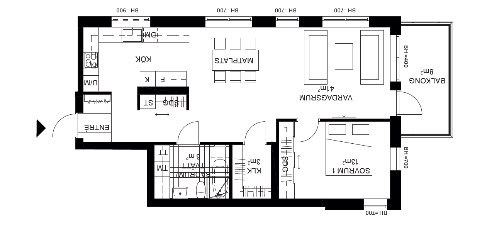
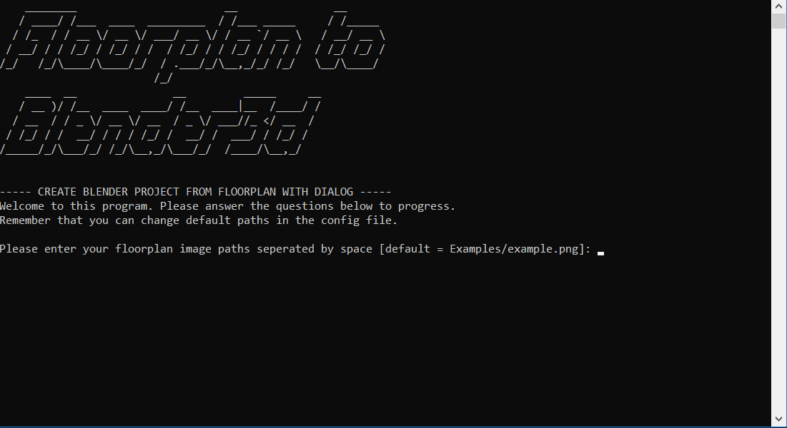
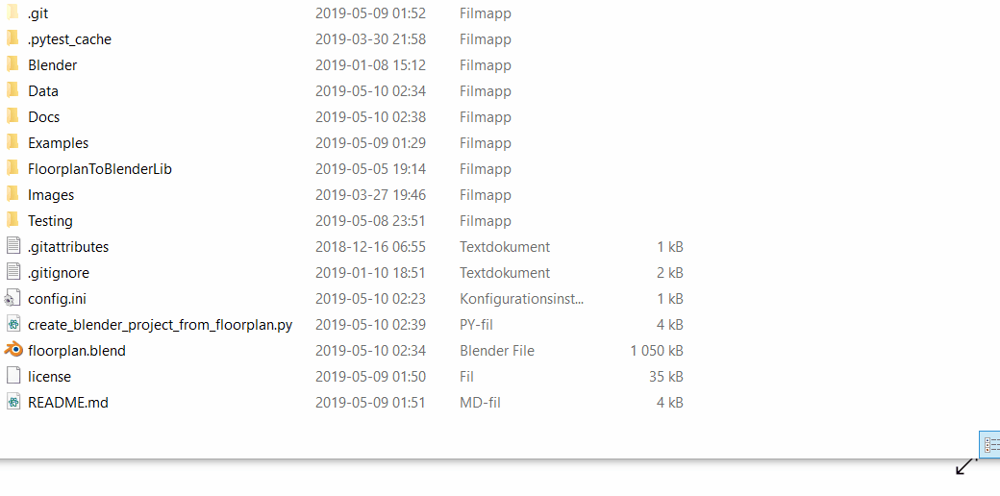

<p align="center">
  
</p>

Convert 2d floorplans to Blender3d objects!


<details>
  <summary><strong>Table of Contents</strong> (click to expand)</summary>

<!-- toc -->

- [About](#about)
- [How-To](#how-to)
- [Install](#install)
- [Run](#run)
- [Run Old but still working](#run (Old but still working!))
- [Demo](#demo)
- [Testing](#testing)
- [References and Imports](#References-and-Imports)
- [Contribute](#contribute)
- [License](#license)
<!-- tocstop -->

</details>

# About
The virtualisation of real life object has been a hot topic for several years. As I started
learning about 3d modelling in [Blender3d](https://www.blender.org/) I thought of this idea to use simple
imaging on floorplans to automatically create corresponding 3d models. It is much easier than it
sounds and uses a low amount of resources, enabling it to be used on low hardware.
 By utilizing Blender3d, all created objects will be easy to transfer
  to any other 3d rendering program. Such as [Unity](https://unity.com/), [Unreal Engine](https://www.unrealengine.com/en-US/)
 or [CAD](https://www.autodesk.com/solutions/cad-software).

# How-To
This part contains information about how to setup and execute this program.

## Install
Several packages and programs are required to run this program.

* `Python3`
* `python-cv` (OpenCV)
* `numpy`
* `configparser`
* `json`

If you have `Python3 pip` installed you can install required packages by running:

```bash
 pip install -r requirements.txt
```

## Run
This tutorial takes you through the execution of this program.

1. Receive floorplan as image, from pdf or by using other method (for example paint)
2. Run python script `create_blender_project_from_floorplan.py`
3. Follow instructions

## Run (Old but still working!)
This tutorial takes you through the execution of this program in examples.

1. Receive floorplan as image, from pdf or by using other method (for example paint)
2. Set image file path in `Examples/floorplan_to_datafile.py`
3. Run ´floorplan_to_datafile.py´ to create data files for your floorplan.
4. Edit path in `floorplan_to_datafile.py` to generated data files.
5. Start blender
6. Open Blender text editor
7. Open `floorplan_to_3dObject_in_blender.py` in blender by pressing the text editor, then `alt+o` and find the file
8. Run script

# Demo
Here we demo the program. First of we need a floorplan image to process.
We use example.png, see below:


Next up we execute our script and answer the questions:


Finally we can open the newly created floorplan.blender file and see the result:


Note that this demo only uses default settings. For instance coloring is by default random.

# Testing
Vital and core functionality are tested with pytest. To run tests yourself enter "Testing"-folder and run:
```cmd
pytest
```

# References and Imports
During the development of this project I have been searching alot and copied code from StackOverflow.
I share links to copied code and other contributors here:

* First look at problem : https://mathematica.stackexchange.com/questions/19546/image-processing-floor-plan-detecting-rooms-borders-area-and-room-names-t
* Room detection : https://stackoverflow.com/questions/54274610/crop-each-of-them-using-opencv-python
* Watershed : https://docs.opencv.org/3.1.0/d3/db4/tutorial_py_watershed.html
* Shape detection : https://docs.opencv.org/3.0-beta/doc/py_tutorials/py_feature2d/py_features_harris/py_features_harris.html
* Distance in image : https://stackoverflow.com/questions/50930033/drawing-lines-and-distance-to-them-on-image-opencv-python
* Rect contain : https://stackoverflow.com/questions/33065834/how-to-detect-if-a-point-is-contained-within-a-bounding-rect-opecv-python
* Line detection : https://docs.opencv.org/3.0-beta/doc/py_tutorials/py_imgproc/py_houghlines/py_houghlines.html
* Readme tips: https://github.com/matiassingers/awesome-readme

# Contribute
Let me know if you want to contribute to this project, also if you want me to add more
functions or answer questions, let me know!

# License
[GNU GENERAL PUBLIC LICENSE](license) Version 3, 29 June 2007

COPYRIGHT @ Grebtsew 2019
