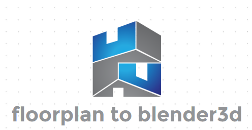
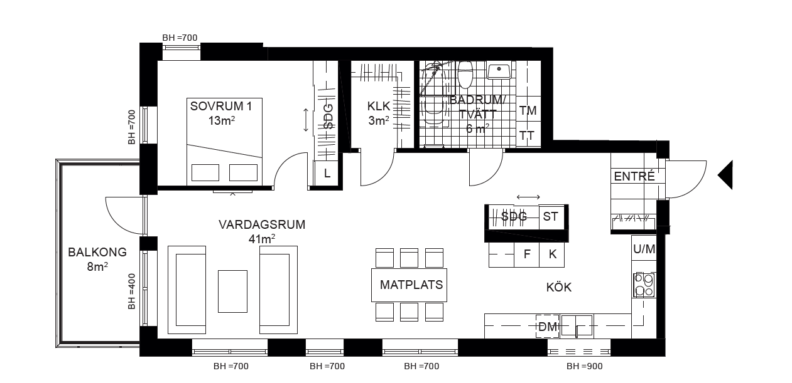
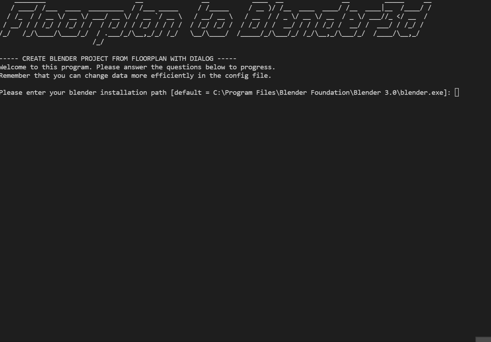
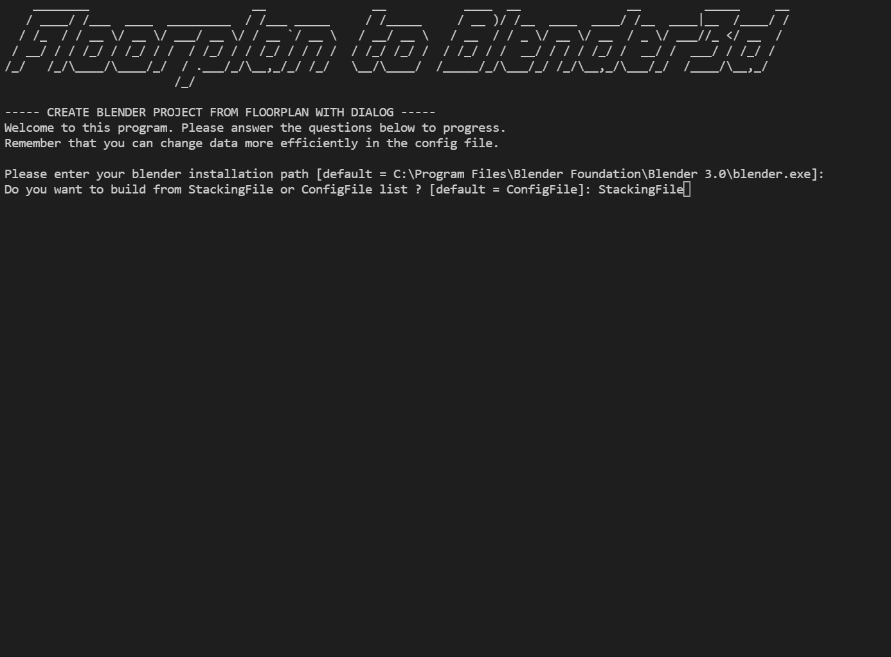

<p align="center">
  
</p>


<!-- TODO Add more relevant badges! -->


<details>
  <summary><strong>Table of Contents</strong> (click to expand)</summary>

<!-- toc -->

- [About](#about)
- [How-To](#how-to)
  - [Run on Docker](#run-on-docker)
  - [Run locally on OS](#run-locally-on-os)
    - [Run Tutorial](#run-tutorial)
  - [ConfigFile](#configfile)
  - [StackingFile](#stackingfile)
- [Demos](#demos)
- [Documentation](#documentation)
- [Testing](#testing)
- [Contribute](#contribute)
- [Known Issues](#Known-Issues)
- [License](#license)
<!-- tocstop -->

</details>


# About
The virtualization of real life objects has been a hot topic for several years. As I started
learning about 3d modelling in [Blender3d](https://www.blender.org/) I thought of the idea to use simple
imaging on floorplans to automatically create corresponding 3d models. It is much easier than it
sounds and uses a low amount of resources, enabling it to be used on low hardware.
 By utilizing Blender3d, all created objects will be easy to transfer
  to any other 3d rendering program. Such as [Unity](https://unity.com/), [Unreal Engine](https://www.unrealengine.com/en-US/)
 or [CAD](https://www.autodesk.com/solutions/cad-software). 

# Contents
This repository contains the floorplan to blender library **FTBL** along with example scripts for converting an image to a 3d model **./create_blender_project_from_floorplan.py**. The repository also contains a server that receives images and converts them into 3d models using the **FTBL** library. The Server contains a [Swagger API](https://swagger.io/) gui and is monitored using a [weavescope](https://github.com/weaveworks/scope) container. Read more about the server implementation [here](./Server/README.md). To allow developers to utilize more functionality a Jupyter tutorial has been added to the project, explaining some of the development steps and functions of the library. Read more about the tutorial [here](./Docs/README.md). Stacking is now also added as a core feature read more about how to use stacking below.

# How-To
This part contains information about how to setup and execute the example script.

<span style="color:yellow">**NOTE**</span>
: Using other versions of the required programs and libraries than specified in Dockerfiles might require changes in the implementation. It is only guaranteed that this implementation will work if the assigned versions and all requirements are met.

<span style="color:yellow">**NOTE**</span>
: To avoid any version related problems use the Docker implementation.

## Run on Docker
Firstly you need to install a suitable [Docker](https://www.docker.com/) environment on your device.
This project contains a `DockerFile` which uses the `Ubuntu 18.04` image so make sure your docker environment is set to linux containers.

This project is linked to [Docker Hub](https://hub.docker.com/r/grebtsew/floorplan-to-blender) which means a maintained and prebuilt container can be pulled directly by running:

```bash
 docker pull grebtsew/floorplan-to-blender
```

The dockerfile is divided into three modes. The script mode where the example script can be tested. 
The server which starts a hosting server instance with a Swagger Api. 
The jupyter notebook where some tutorials and examples are further explained.

By using the different docker-compose files these modes are automatically selected for you.

<span style="color:blue">**NOTE**</span>
: For more information about how the dockerfile and docker-compose files can be used to build and run the image to add your own content read more [here](./Docs/README.md).

To pull and run the container together in a one line command run:
```bash
# For Script mode:
 docker-compose run ftb
# For Server mode: Read more "./Server/README.md"
 docker-compose -f docker-compose.server.yml up
# For jupyter mode: Read more "./Docs/README.md"
 cd ./Docs
 docker-compose up
```

**NOTE**: When changing between modes the container sometimes need to be rebuild, that can be done by adding the --build flag to the commands above.

## Run locally on OS
This tutorial will describe how to install this implementation directly on your device.
If you are a `Linux/Ubuntu` user, look at `Dockerfile` for better instructions.

These are the programs that are required to run this implementation.

* [Blender3d >  2.93](https://www.blender.org/)
* `Python >== 3.8.0`

Clone or download this repo:
```git
git clone https://github.com/grebtsew/FloorplanToBlender3d.git
````

With a suitable `blender`, `python` and `python pip` installed you can have `Python3 pip` install all required  packages by running:

```bash
 pip install -r requirements.txt
```

### Run Tutorial
This tutorial takes you through the execution of this program.

1. Receive floorplan as image, from pdf or by using other method (for example paint)
2. (Optional) create a new ConfigFile in `Configs` folder or StackingFile in `Stacking` folder.
2. Run python script `create_blender_project_from_floorplan.py`
3. Follow instructions
4. Created `floorplan.blender` files will be saved under `./target`

<span style="color:blue">**NOTE**</span>
: For more information about alternative ways of executing the implementation read more [here](./Docs/README.md).

## Update Settings in Config files
When the implementation run the first time a `system.ini` and ``default.ini` file is created.

## ConfigFile
With the new update of the implementation `ConfigFiles` are added. These files describe information about each floorplan class instance. In this file model transform can be changed. If no config is added, default will be used. To generate a new default file remove or move the old one. Next to the default config file is the system default config file containing additional settings for the entire system. All configs are placed inside the `Configs` folder.

## StackingFile
With the new update the `StackingFile` was added. StackingFiles are used to create worlds of floorplans at once. Using a self developed parsing language. See the example files in the `Stacking` folder.

# Demos

## Create Floorplan in Blender3d
Here we demo the program. First of we need a floorplan image to process.
We use `example.png`, see below:


Next up we execute our script and answer the questions:


Finally we can open the newly created floorplan.blender file and see the result:


<span style="color:blue">**NOTE**</span>: This demo only uses default settings. For instance coloring is by default random.

## Create several floorplans using Stacking
Here we instead use StackingFiles to create a world containing several floorplans.

Show the result.


## Floorplan To Blender Server with Swagger API
The server implementation comes with an automatically generated [Swagger API](https://swagger.io/) page.


## Usages in other applications
If you are interested in code for these demos they are accessable in another repository [here](https://github.com/grebtsew/ARFloorplanDemo).

### AR foundation place floorplans in world

<p align="left">
  
</p>

### AR foundation real life scaling of floorplans

<p align="left">
  
</p>

### AR foundation interior design of floorplans

<p align="left">
  
</p>

### AR foundation with MediaPipe Hands interactions

<p align="left">
  
</p>

# Documentation
For more information and tutorial of how to use the ftb library do checkout [docs](Docs/README.md)!

# Testing
Vital and core functionality are tested with pytest. To run tests yourself enter `Testing`-folder and run:
```cmd
pytest
```


# Contribute
Let me know if you want to contribute to this project, also if you want me to add more
functions or answer questions, let me know!

# Known Issues
These are some known and relevant issues with the current implementation:
* Floorplan images needs to be quite small for detections to work at this time. If you plan on using a large image, consider downsizing it.
* Required programs and libraries might change in future versions, this might require some changes in this implementation for it to work. If you insist on not using the versions specified in Dockerfile, a coding effort might be required.

# License
[GNU GENERAL PUBLIC LICENSE](license) Version 3, 29 June 2007

COPYRIGHT @ Grebtsew 2021
